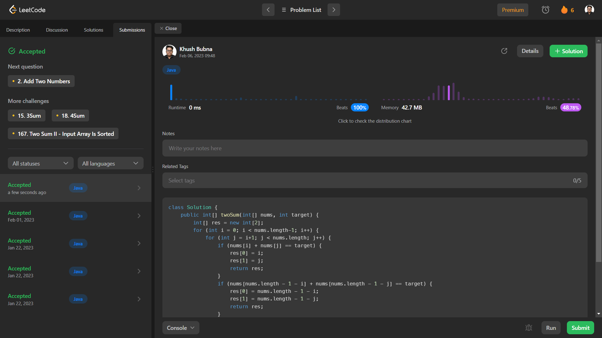

# Problem: Two Sum

Platform: Leetcode

Difficulty: Easy

Problem Link: https://leetcode.com/problems/two-sum/

## Problem Statement:

Given an array of integers nums and an integer target, return indices of the two numbers such that they add up to target.

You may assume that each input would have exactly one solution, and you may not use the same element twice.

You can return the answer in any order.

Example 1:

    Input: nums = [2,7,11,15], target = 9
    Output: [0,1]
    Explanation: Because nums[0] + nums[1] == 9, we return [0, 1].
    
Example 2:

    Input: nums = [3,2,4], target = 6
    Output: [1,2]

## My Approach:

    1. We make a result array of size 2.
    2. Run an outer loop i from 0 to size of nums -1.
    3. Run an Inner loop j from i to size of nums.
    4. Now we check if nums[i]+nums[j]== target
        -If true we add i and j in result array and return it.
    5. Else we also check from the end of the nums array if those are equal to target, we return those indexes.
    Eg:
        nums=[1,2,5,7,8,9,6,1,4]
        target=5
        - In step 4 we check from index 0
            Hence nums[0]+nums[1,2,3,....]
        - In step 5 we check from index 8
            Hence nums[8]+nums[7,6,5,....]

## Solution (In Java):

    class Solution {
        public int[] twoSum(int[] nums, int target) {
            int[] res = new int[2];
            for (int i = 0; i < nums.length-1; i++) {
                for (int j = i+1; j < nums.length; j++) {
                    if (nums[i] + nums[j] == target) {
                        res[0] = i;
                        res[1] = j;
                        return res;
                    }
                    if (nums[nums.length - 1 - i] + nums[nums.length - 1 - j] == target) {
                        res[0] = nums.length - 1 - i;
                        res[1] = nums.length - 1 - j;
                        return res;
                    }
                }
            }
            return null;
        }
    }

## Output:

