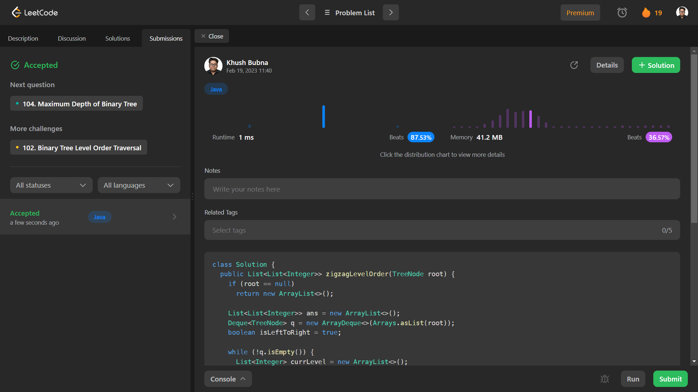

# Problem: Binary Tree Zigzag Level Order Traversal

Platform: Leetcode

Difficulty: Medium

Problem Link: https://leetcode.com/problems/binary-tree-zigzag-level-order-traversal/

## Problem Statement:

Given the root of a binary tree, return the zigzag level order traversal of its nodes' values. (i.e., from left to right, then right to left for the next level and alternate between).

Example 1:

    Input: root = [3,9,20,null,null,15,7]
    Output: [[3],[20,9],[15,7]]

## Solution (In Java):

    class Solution {
        public List<List<Integer>> zigzagLevelOrder(TreeNode root) {
            if (root == null)
            return new ArrayList<>();

            List<List<Integer>> ans = new ArrayList<>();
            Deque<TreeNode> q = new ArrayDeque<>(Arrays.asList(root));
            boolean isLeftToRight = true;

            while (!q.isEmpty()) {
            List<Integer> currLevel = new ArrayList<>();
            for (int sz = q.size(); sz > 0; --sz)
                if (isLeftToRight) {
                TreeNode node = q.pollFirst();
                currLevel.add(node.val);
                if (node.left != null)
                    q.addLast(node.left);
                if (node.right != null)
                    q.addLast(node.right);
                } else {
                TreeNode node = q.pollLast();
                currLevel.add(node.val);
                if (node.right != null)
                    q.addFirst(node.right);
                if (node.left != null)
                    q.addFirst(node.left);
                }
            ans.add(currLevel);
            isLeftToRight = !isLeftToRight;
            }

            return ans;
        }
        }

## Output:

