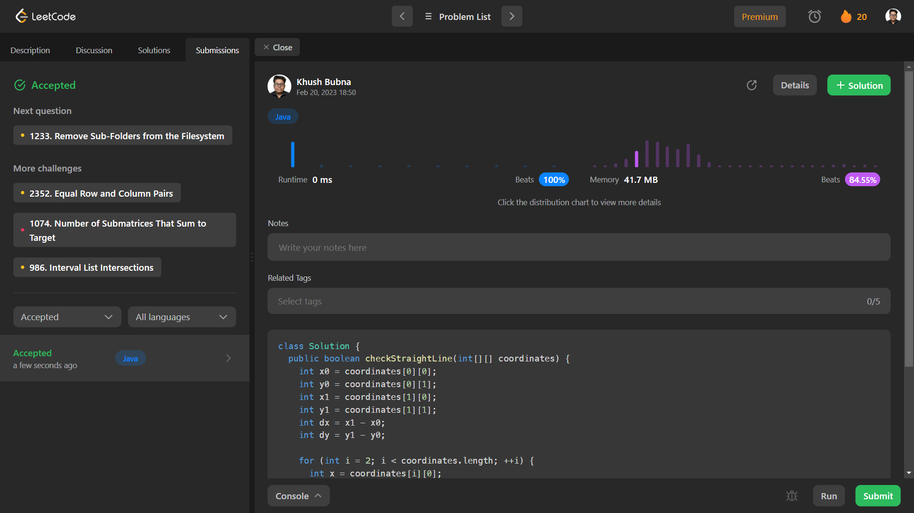

# Problem: Check If It Is a Straight Line

Platform: Leetcode

Difficulty: Easy

Problem Link: https://leetcode.com/problems/check-if-it-is-a-straight-line/

## Problem Statement:

You are given an array coordinates, coordinates[i] = [x, y], where [x, y] represents the coordinate of a point. Check if these points make a straight line in the XY plane.

Example 1:

    Input: coordinates = [[1,2],[2,3],[3,4],[4,5],[5,6],[6,7]]
    Output: true

## My Approach:

    1. calculate slope for each point.
        Slope = y2 - y1 / x2 - x1      

## Solution (In Java):

    class Solution {
        public boolean checkStraightLine(int[][] coordinates) {
            int x0 = coordinates[0][0];
            int y0 = coordinates[0][1];
            int x1 = coordinates[1][0];
            int y1 = coordinates[1][1];
            int dx = x1 - x0;
            int dy = y1 - y0;

            for (int i = 2; i < coordinates.length; ++i) {
            int x = coordinates[i][0];
            int y = coordinates[i][1];
            if ((x - x0) * dy != (y - y0) * dx)
                return false;
            }

            return true;
        }
        }

## Output:

