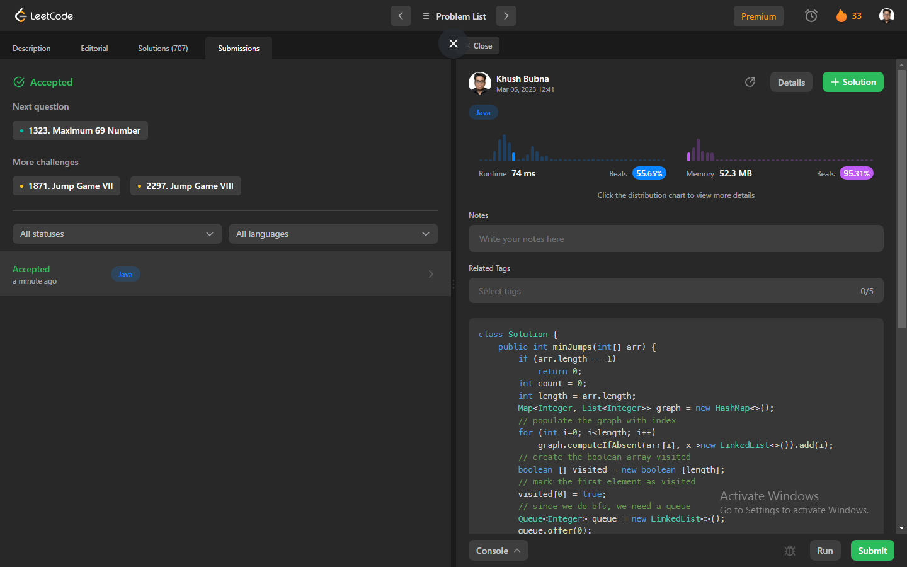

# Problem: Jump Game IV

Platform: Leetcode

Difficulty: Hard

Problem Link: https://leetcode.com/problems/jump-game-iv/description/

## Problem Statement:

Given an array of integers arr, you are initially positioned at the first index of the array.

In one step you can jump from index i to index:

i + 1 where: i + 1 < arr.length.
i - 1 where: i - 1 >= 0.
j where: arr[i] == arr[j] and i != j.
Return the minimum number of steps to reach the last index of the array.

Notice that you can not jump outside of the array at any time.

Example 1:

    Input: arr = [100,-23,-23,404,100,23,23,23,3,404]
    Output: 3
    Explanation: You need three jumps from index 0 --> 4 --> 3 --> 9. Note that index 9 is the last index of the array.

## Solution (In Java):

    class Solution {
        public int minJumps(int[] arr) {
            if (arr.length == 1)
                return 0;
            int count = 0;
            int length = arr.length;
            Map<Integer, List<Integer>> graph = new HashMap<>();
            // populate the graph with index
            for (int i=0; i<length; i++)
                graph.computeIfAbsent(arr[i], x->new LinkedList<>()).add(i);
            // create the boolean array visited
            boolean [] visited = new boolean [length];
            // mark the first element as visited
            visited[0] = true;
            // since we do bfs, we need a queue
            Queue<Integer> queue = new LinkedList<>();
            queue.offer(0);
            while (!queue.isEmpty()) {
                int size = queue.size();
                for (int i=size; i>0; i--) {
                    int current = queue.poll();
                    // if we reach the last index
                    if (current == length - 1)
                        return count;
                    // get the possible next values
                    List<Integer> next = graph.get(arr[current]);
                    // now lets add the previous, ie current-1, next ies, current + 1 into the list
                    next.add(current-1);
                    next.add(current+1);
                    for (Integer j:next) {
                        if (j >= 0 && j<length && !visited[j]) {
                            visited[j] = true;
                            queue.offer(j);
                        }
                    }
                    next.clear(); 
                }
                count += 1;
            }
            return 0;
        }
    }

## Output:

