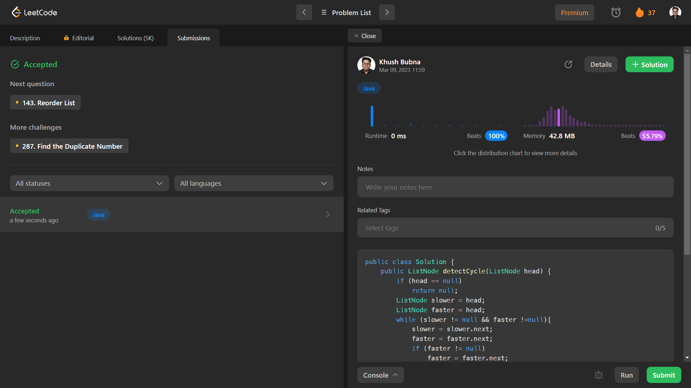

# Problem: Linked List Cycle II

Platform: Leetcode

Difficulty: Medium

Problem Link: https://leetcode.com/problems/linked-list-cycle-ii/description/

## Problem Statement:

Given the head of a linked list, return the node where the cycle begins. If there is no cycle, return null.

There is a cycle in a linked list if there is some node in the list that can be reached again by continuously following the next pointer. Internally, pos is used to denote the index of the node that tail's next pointer is connected to (0-indexed). It is -1 if there is no cycle. Note that pos is not passed as a parameter.

Do not modify the linked list.

Example 1:

    Input: head = [3,2,0,-4], pos = 1
    Output: tail connects to node index 1
    Explanation: There is a cycle in the linked list, where tail connects to the second node.

## Solution (In Java):

    public class Solution {
        public ListNode detectCycle(ListNode head) {
            if (head == null)
                return null;
            ListNode slower = head;
            ListNode faster = head;
            while (slower != null && faster !=null){
                slower = slower.next;
                faster = faster.next;
                if (faster != null)
                    faster = faster.next;
                if (slower == faster)
                    break;
            }//while
            if (faster == null)
                return null;
            slower = head;
            while (slower != faster){
                slower = slower.next;
                faster = faster.next;
            }
            return slower;
        }//detectCycle
    }

## Output:

