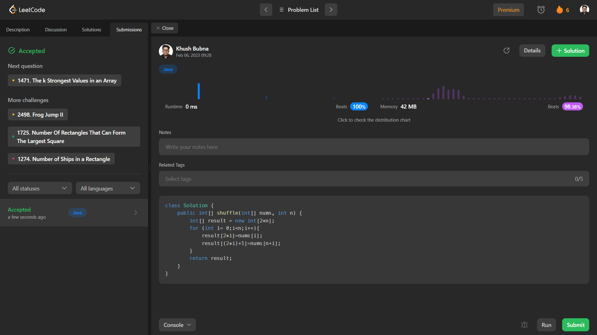

# Problem: Zigzag Conversion

Platform: Leetcode

Difficulty: Medium

Problem Link: https://leetcode.com/problems/zigzag-conversion/

## Problem Statement:

The string "PAYPALISHIRING" is written in a zigzag pattern on a given number of rows like this: (you may want to display this pattern in a fixed font for better legibility)

    P   A   H   N
    A P L S I I G
    Y   I   R

And then read line by line: "PAHNAPLSIIGYIR"

Write the code that will take a string and make this conversion given a number of rows:

string convert(string s, int numRows);
 
Example 1:

    Input: s = "PAYPALISHIRING", numRows = 4
    Output: "PINALSIGYAHRPI"
    Explanation:
    P     I    N
    A   L S  I G
    Y A   H R
    P     I

## My Approach:

    1. Create a new array of size 2n.
    2. We will run a loop from 0 to n.
    3. For all even indexes of result array we will add elements from index 0 of nums
    4. For all odd indexes of result array we will add elements from index n of nums

## Solution (In Java):

    class Solution {
        public int[] shuffle(int[] nums, int n) {
            int[] result = new int[2*n];
            for (int i= 0;i<n;i++){
                result[2*i]=nums[i];
                result[(2*i)+1]=nums[n+i];
            }
            return result;
        }
    }

## Output:

