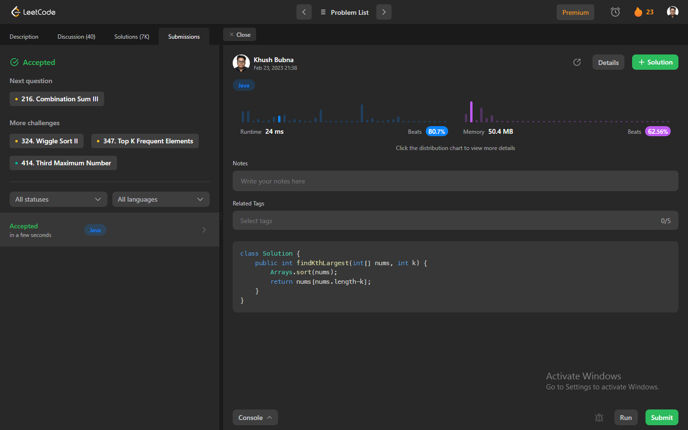

# Problem: Kth Largest Element in an Array

Platform: Leetcode

Difficulty: Medium

Problem Link: https://leetcode.com/problems/kth-largest-element-in-an-array/

## Problem Statement:

Given an integer array nums and an integer k, return the kth largest element in the array.

Note that it is the kth largest element in the sorted order, not the kth distinct element.

You must solve it in O(n) time complexity.

Example 1:
    Input: nums = [3,2,1,5,6,4], k = 2
    Output: 5

## Solution (In Java):

    class Solution {
        public int findKthLargest(int[] nums, int k) {
            Arrays.sort(nums);
            return nums[nums.length-k];
        }
    }

## Output:
