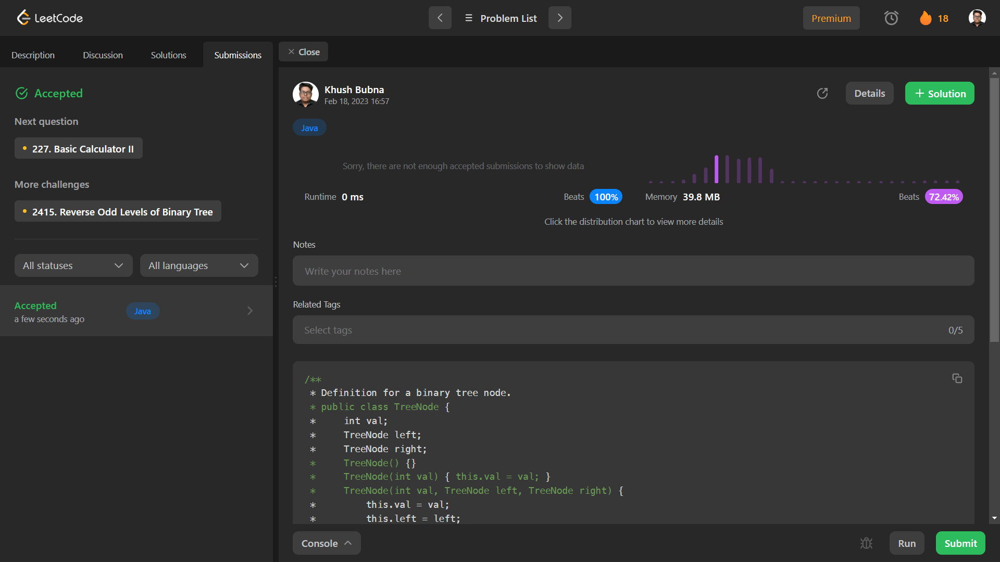

# Problem: Invert Binary Tree

Platform: Leetcode

Difficulty: Easy

Problem Link: https://leetcode.com/problems/invert-binary-tree/

## Problem Statement:

Given the root of a binary tree, invert the tree, and return its root.

Example 1:

    Input: root = [4,2,7,1,3,6,9]
    Output: [4,7,2,9,6,3,1]

## Solution (In Java):

    class Solution {
        public TreeNode invertTree(TreeNode root) {
            if (root == null || (root.left == null && root.right == null)) return root;

            TreeNode tmp = root.left;
            root.left = root.right;
            root.right = tmp;

            invertTree(root.left);
            invertTree(root.right);
            return root;
            
        }
    }

## Output:

