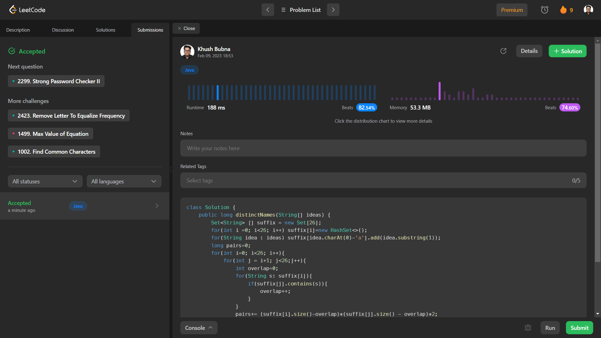

# Problem: Naming a Company

Platform: Leetcode

Difficulty: Hard

Problem Link: https://leetcode.com/problems/naming-a-company/

## Problem Statement:

You are given an array of strings ideas that represents a list of names to be used in the process of naming a company. The process of naming a company is as follows:

Choose 2 distinct names from ideas, call them ideaA and ideaB.
Swap the first letters of ideaA and ideaB with each other.
If both of the new names are not found in the original ideas, then the name ideaA ideaB (the concatenation of ideaA and ideaB, separated by a space) is a valid company name.
Otherwise, it is not a valid name.
Return the number of distinct valid names for the company.
 
Example 1:

    Input: ideas = ["coffee","donuts","time","toffee"]
    Output: 6
    Explanation: The following selections are valid:
    - ("coffee", "donuts"): The company name created is "doffee conuts".
    - ("donuts", "coffee"): The company name created is "conuts doffee".
    - ("donuts", "time"): The company name created is "tonuts dime".
    - ("donuts", "toffee"): The company name created is "tonuts doffee".
    - ("time", "donuts"): The company name created is "dime tonuts".
    - ("toffee", "donuts"): The company name created is "doffee tonuts".
    Therefore, there are a total of 6 distinct company names.

    The following are some examples of invalid selections:
    - ("coffee", "time"): The name "toffee" formed after swapping already exists in the original array.
    - ("time", "toffee"): Both names are still the same after swapping and exist in the original array.
    - ("coffee", "toffee"): Both names formed after swapping already exist in the original array.

## My Approach:

    1. Grouping suffixes by first letter.
    c --> offee
    d --> onuts
    t --> ime, offee

    2. for each pair of letters: find non-overlapping suffixes
        - pairs = non-overlapping suffixes[1st] * non-overlapping suffixes[2nd] * 2

## Solution (In Java):

    class Solution {
        public long distinctNames(String[] ideas) {
            Set<String> [] suffix = new Set[26];
            for(int i =0; i<26; i++) suffix[i]=new HashSet<>();
            for(String idea : ideas) suffix[idea.charAt(0)-'a'].add(idea.substring(1));
            long pairs=0;
            for(int i=0; i<26; i++){
                for(int j = i+1; j<26;j++){
                    int overlap=0;
                    for(String s: suffix[i]){
                        if(suffix[j].contains(s)){
                            overlap++;
                        }
                    }
                    pairs+= (suffix[i].size()-overlap)*(suffix[j].size() - overlap)*2;
                }
            }
            return pairs;
        }
    }

## Output:

