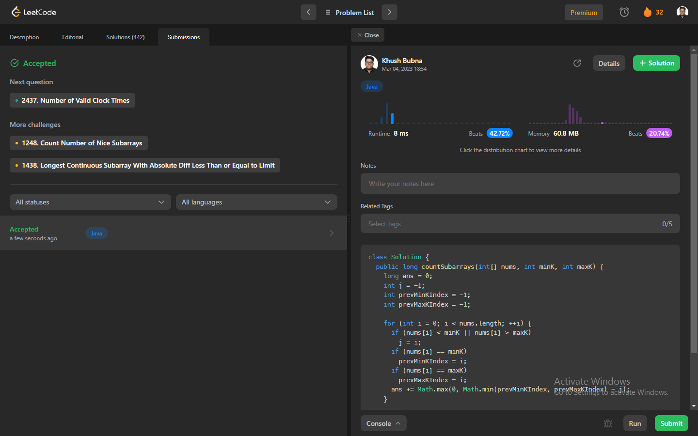

# Problem: Two Sum

Platform: Leetcode

Difficulty: Easy

Problem Link: https://leetcode.com/problems/two-sum/

## Problem Statement:

You are given an integer array nums and two integers minK and maxK.

A fixed-bound subarray of nums is a subarray that satisfies the following conditions:

The minimum value in the subarray is equal to minK.
The maximum value in the subarray is equal to maxK.
Return the number of fixed-bound subarrays.

A subarray is a contiguous part of an array.

Example 1:

    Input: nums = [1,3,5,2,7,5], minK = 1, maxK = 5
    Output: 2
    Explanation: The fixed-bound subarrays are [1,3,5] and [1,3,5,2].

## Solution (In Java):

    class Solution {
        public long countSubarrays(int[] nums, int minK, int maxK) {
            long ans = 0;
            int j = -1;
            int prevMinKIndex = -1;
            int prevMaxKIndex = -1;

            for (int i = 0; i < nums.length; ++i) {
            if (nums[i] < minK || nums[i] > maxK)
                j = i;
            if (nums[i] == minK)
                prevMinKIndex = i;
            if (nums[i] == maxK)
                prevMaxKIndex = i;
            ans += Math.max(0, Math.min(prevMinKIndex, prevMaxKIndex) - j);
            }

            return ans;
        }
    }

## Output:

