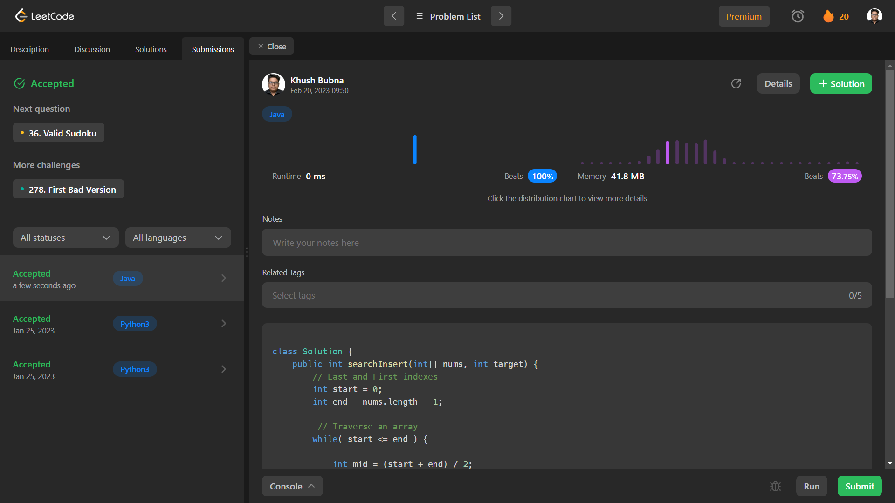

# Problem: Search Insert Position

Platform: Leetcode

Difficulty: Easy

Problem Link: https://leetcode.com/problems/search-insert-position/

## Problem Statement:

Given a sorted array of distinct integers and a target value, return the index if the target is found. If not, return the index where it would be if it were inserted in order.

You must write an algorithm with O(log n) runtime complexity.

Example 1:

    Input: nums = [1,3,5,6], target = 5
    Output: 2

## Solution (In Java):
       
    class Solution {
        public int searchInsert(int[] nums, int target) {
            // Last and First indexes
            int start = 0;
            int end = nums.length - 1;
            
            // Traverse an array
            while( start <= end ) {
                
                int mid = (start + end) / 2;
                
                //if target value found.
                if(nums[mid] == target) {
                    return mid;
                }
                
                // If target value is greater then mid elements's value
                else if (target > nums[mid]) {
                    start = mid + 1;
                }
                
                //otherwise target value is less, 
                else {
                    end = mid - 1;
                }
            }
            // Return the insertion position
            return end + 1;
        }
    }

## Output:

