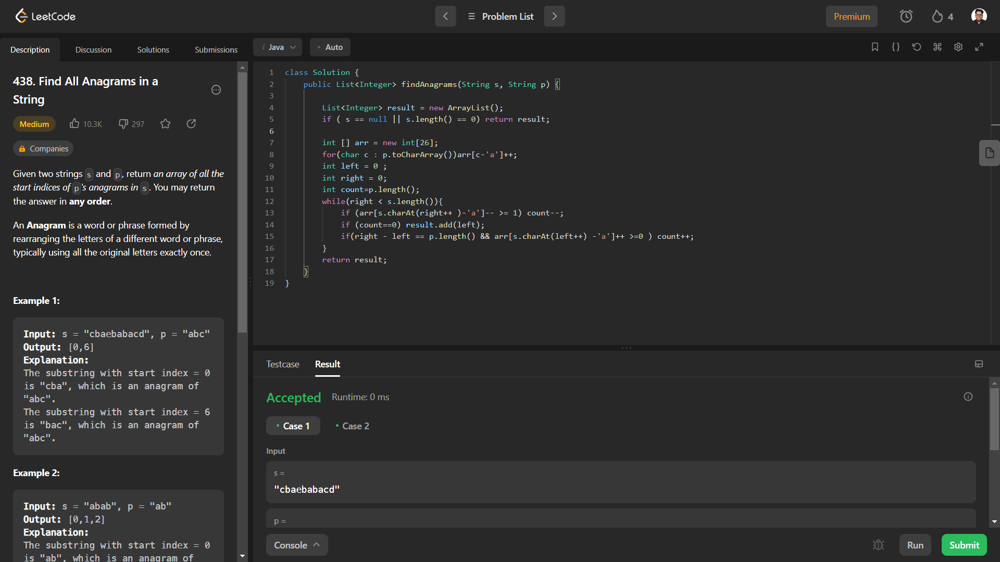

# Problem: Find All Anagrams in a String

Platform: Leetcode

Difficulty: Medium

Problem Link: https://leetcode.com/problems/find-all-anagrams-in-a-string/

## Problem Statement:

Given two strings s and p, return an array of all the start indices of p's anagrams in s. You may return the answer in any order.

An Anagram is a word or phrase formed by rearranging the letters of a different word or phrase, typically using all the original letters exactly once.

Example 1:

    Input: s = "cbaebabacd", p = "abc"
    Output: [0,6]
    Explanation:
    The substring with start index = 0 is "cba", which is an anagram of "abc".
    The substring with start index = 6 is "bac", which is an anagram of "abc".

Example 2:

    Input: s = "abab", p = "ab"
    Output: [0,1,2]
    Explanation:
    The substring with start index = 0 is "ab", which is an anagram of "ab".
    The substring with start index = 1 is "ba", which is an anagram of "ab".
    The substring with start index = 2 is "ab", which is an anagram of "ab".

## My Approach:

    Anagrams are in simple permuataions of one string with same length and same number of each characters.
    1. Create two character arrays for both string s and p
    2. using sliding window
    3. we check if both arrays in that window are equal if yes then it is anagram.

## Solution (In Java):

    class Solution {
        public List<Integer> findAnagrams(String s, String p) {

            List<Integer> result = new ArrayList();
            if ( s == null || s.length() == 0) return result;

            int [] arr = new int[26];
            for(char c : p.toCharArray())arr[c-'a']++;
            int left = 0 ;
            int right = 0;
            int count=p.length();
            while(right < s.length()){
                if (arr[s.charAt(right++ )-'a']-- >= 1) count--;
                if (count==0) result.add(left);
                if(right - left == p.length() && arr[s.charAt(left++) -'a']++ >=0 ) count++;
            }
            return result;
        }
    }

## Output:

