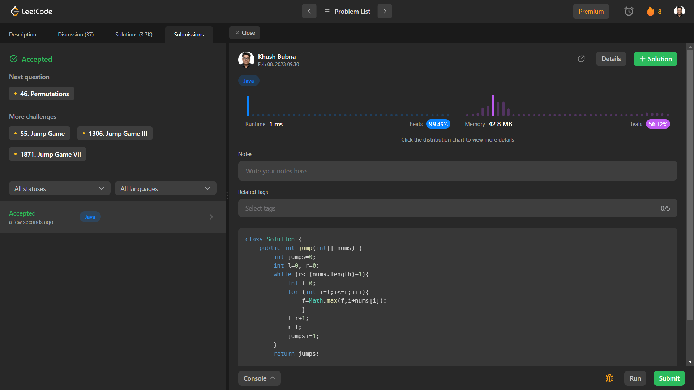

# Problem: Jump Game II
Platform: Leetcode

Difficulty: Medium

Problem Link: https://leetcode.com/problems/jump-game-ii/

## Problem Statement:

You are given a 0-indexed array of integers nums of length n. You are initially positioned at nums[0].

Each element nums[i] represents the maximum length of a forward jump from index i. In other words, if you are at nums[i], you can jump to any nums[i + j] where:

0 <= j <= nums[i] and
i + j < n
Return the minimum number of jumps to reach nums[n - 1]. The test cases are generated such that you can reach nums[n - 1].

Example 1:

    Input: nums = [2,3,1,1,4]
    Output: 2
    Explanation: The minimum number of jumps to reach the last index is 2. Jump 1 step from index 0 to 1, then 3 steps to the last index.

## My Approach:

    1. This is a BFS problem.
    2. So we create a window of Max number in the last window.
    3. And each window is basically one jump. As we can jump from one window to another.
    eg: [2, 3, 1, 1, 4]
            _____ _____ 
        - Here 2 is the number at nums[0]
        - Thats our initial window size.
        - Then we create a window of 2 elements and the max here is 3.
        - So the next window will be of size 3.
        - Now we have reached the end of array so we created two windows hence minimum number of jumps is 2.         

## Solution (In Java):

    class Solution {
        public int jump(int[] nums) {
            int jumps=0;
            int l=0, r=0;
            while (r< (nums.length)-1){
                int f=0;
                for (int i=l;i<=r;i++){
                    f=Math.max(f,i+nums[i]);
                    }
                l=r+1;
                r=f;
                jumps+=1;
            }
            return jumps;
            
        }
    }

## Output:

