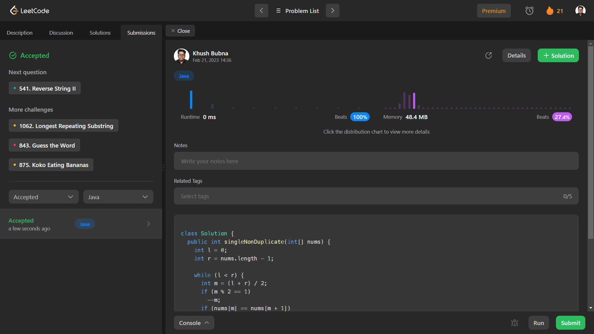

# Problem: Single Element in a Sorted Array

Platform: Leetcode

Difficulty: Medium

Problem Link: https://leetcode.com/problems/single-element-in-a-sorted-array/

## Problem Statement:

You are given a sorted array consisting of only integers where every element appears exactly twice, except for one element which appears exactly once.

Return the single element that appears only once.

Your solution must run in O(log n) time and O(1) space.

Example 1:

    Input: nums = [1,1,2,3,3,4,4,8,8]
    Output: 2

## Solution (In Python):
    
    
class Solution {
    public int singleNonDuplicate(int[] nums) {
        int l = 0;
        int r = nums.length - 1;

        while (l < r) {
        int m = (l + r) / 2;
        if (m % 2 == 1)
            --m;
        if (nums[m] == nums[m + 1])
            l = m + 2;
        else
            r = m;
        }

        return nums[l];
    }
    }

## Output:

