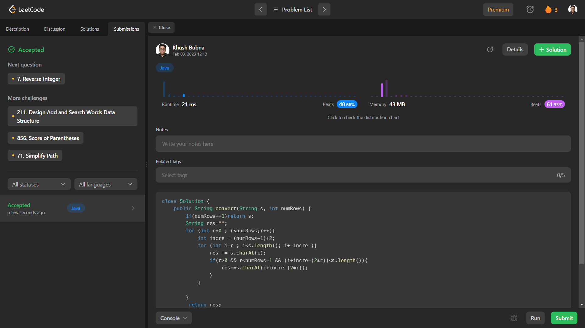

# Problem: Zigzag Conversion

Platform: Leetcode

Difficulty: Medium

Problem Link: https://leetcode.com/problems/zigzag-conversion/

## Problem Statement:

The string "PAYPALISHIRING" is written in a zigzag pattern on a given number of rows like this: (you may want to display this pattern in a fixed font for better legibility)

    P   A   H   N
    A P L S I I G
    Y   I   R

And then read line by line: "PAHNAPLSIIGYIR"

Write the code that will take a string and make this conversion given a number of rows:

string convert(string s, int numRows);
 
Example 1:

    Input: s = "PAYPALISHIRING", numRows = 4
    Output: "PINALSIGYAHRPI"
    Explanation:
    P     I    N
    A   L S  I G
    Y A   H R
    P     I

## My Approach:

    1. If number of rows(r)==1:
        return string as it is

    2. To read the characters in zig-zag pattern we choose the letter at first index then 
        a. for first and the last row of zig-zag:
            - The next character would be at index = (r-1)*2
        b. for in between rows 
            -the next character would be at index = i+(r-1)*2 - 2*r
            wher i is the current row number 

## Solution (In Java):

    class Solution {
        public String convert(String s, int numRows) {
            if(numRows==1)return s;
            String res="";
            for (int r=0 ; r<numRows;r++){
                int incre = (numRows-1)*2;
                for (int i=r ; i<s.length(); i+=incre ){
                    res += s.charAt(i);
                    if(r>0 && r<numRows-1 && (i+incre-(2*r))<s.length()){
                        res+=s.charAt(i+incre-(2*r));
                    }
                }
        
            }
            return res;

        }
    }

## Output:

