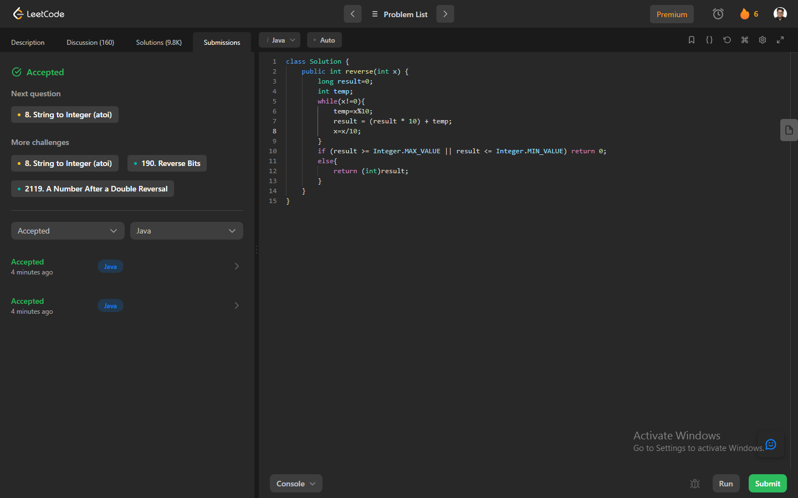

# Problem: Reverse Integer

Platform: Leetcode

Difficulty: Easy

Problem Link: https://leetcode.com/problems/reverse-integer/

## Problem Statement:

Given a signed 32-bit integer x, return x with its digits reversed. If reversing x causes the value to go outside the signed 32-bit integer range [-231, 231 - 1], then return 0.

Assume the environment does not allow you to store 64-bit integers (signed or unsigned).

Example 1:

    Input: x = 123
    Output: 321

Example 2:

    Input: x = -123
    Output: -321

## My Approach:

    1. we create a new variable to store the reverse number.
    2. also a temp variable to store the remainder.
    3. Run a loop until the alue x becomes zero.
    4. Inside the loop
        - We first store the remainder of x divided by 10 in temp
        - Then we update are result by multiplying the previous result stored by 10 and then add the remainder.
        - Then we divide the original number by 10
    5. Then we check if the result is in the range on integer data type and 
        - return result if true
        - return 0 if false

## Solution (In Java):

    class Solution {
        public int reverse(int x) {
            long result=0;
            int temp;
            while(x!=0){
                temp=x%10;
                result = (result * 10) + temp;
                x=x/10;
            }
            if (result >= Integer.MAX_VALUE || result <= Integer.MIN_VALUE) return 0;
            else{
                return (int)result;
            } 
        }
    }

## Output:

