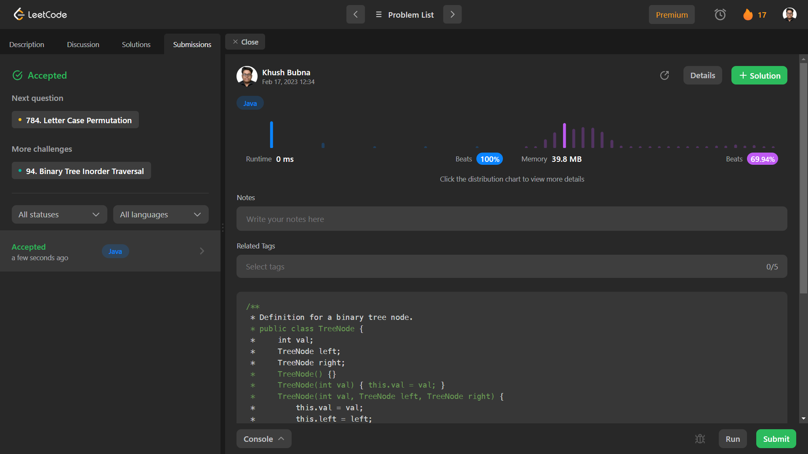

# Problem: Minimum Distance Between BST Nodes

Platform: Leetcode

Difficulty: Easy

Problem Link: https://leetcode.com/problems/minimum-distance-between-bst-nodes/

## Problem Statement:

Given the root of a Binary Search Tree (BST), return the minimum difference between the values of any two different nodes in the tree.

Example 1:

    Input: root = [4,2,6,1,3]
    Output: 1

## Solution (In Java):

    class Solution {
        Integer res = Integer.MAX_VALUE, pre = null;
        public int minDiffInBST(TreeNode root) {
            if (root.left != null) minDiffInBST(root.left);
            if (pre != null) res = Math.min(res, root.val - pre);
            pre = root.val;
            if (root.right != null) minDiffInBST(root.right);
            return res;
        }
    }

## Output:

