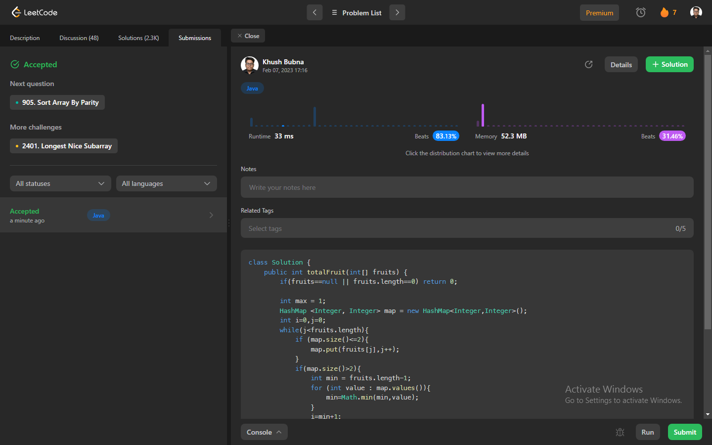

# Problem: Fruit Into Baskets

Platform: Leetcode

Difficulty: Medium

Problem Link: https://leetcode.com/problems/fruit-into-baskets/

## Problem Statement:

You are visiting a farm that has a single row of fruit trees arranged from left to right. The trees are represented by an integer array fruits where fruits[i] is the type of fruit the ith tree produces.

You want to collect as much fruit as possible. However, the owner has some strict rules that you must follow:

You only have two baskets, and each basket can only hold a single type of fruit. There is no limit on the amount of fruit each basket can hold.
Starting from any tree of your choice, you must pick exactly one fruit from every tree (including the start tree) while moving to the right. The picked fruits must fit in one of your baskets.
Once you reach a tree with fruit that cannot fit in your baskets, you must stop.
Given the integer array fruits, return the maximum number of fruits you can pick.

Example 1:

    Input: fruits = [1,2,1]
    Output: 3
    Explanation: We can pick from all 3 trees.

Example 2:

    Input: fruits = [0,1,2,2]
    Output: 3
    Explanation: We can pick from trees [1,2,2].
    If we had started at the first tree, we would only pick from trees [0,1].

## My Approach:

    1. We have to get max possible subarray with only two consecutive inputs.
    2. We use hashmap to check this condition.

## Solution (In Java):

    class Solution {
        public int totalFruit(int[] fruits) {
            if(fruits==null || fruits.length==0) return 0;

            int max = 1;
            HashMap <Integer, Integer> map = new HashMap<Integer,Integer>();
            int i=0,j=0;
            while(j<fruits.length){
                if (map.size()<=2){
                    map.put(fruits[j],j++);
                }
                if(map.size()>2){
                    int min = fruits.length-1;
                    for (int value : map.values()){
                        min=Math.min(min,value);
                    }
                    i=min+1;
                    map.remove(fruits[min]);
                }
                max=Math.max(max,j-i);
            }
            return max;
            
        }
    }

## Output:

