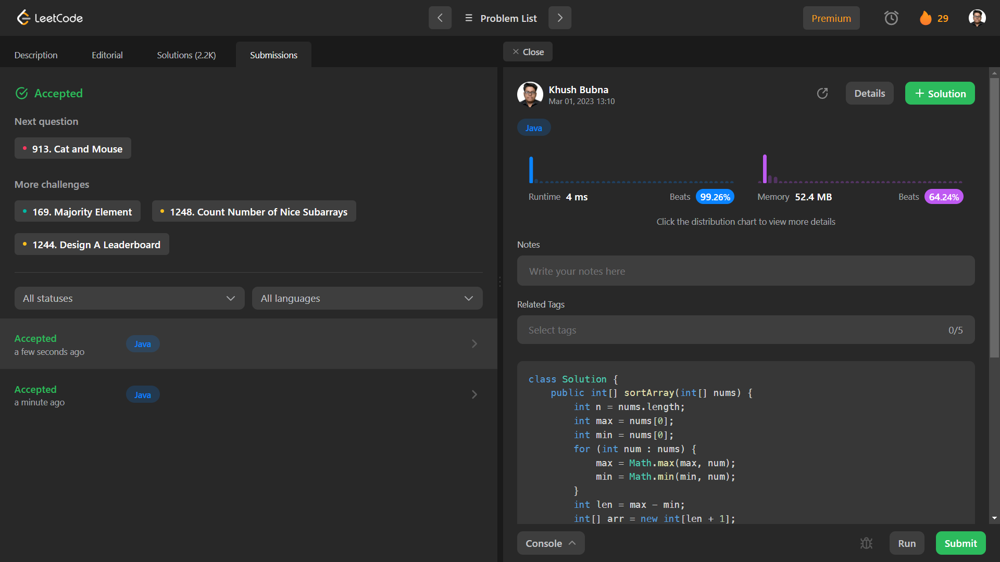

# Problem: Sort an Array

Platform: Leetcode

Difficulty: Medium

Problem Link: https://leetcode.com/problems/sort-an-array/

## Problem Statement:

Given an array of integers nums, sort the array in ascending order and return it.

You must solve the problem without using any built-in functions in O(nlog(n)) time complexity and with the smallest space complexity possible.

Example 1:

    Input: nums = [5,2,3,1]
    Output: [1,2,3,5]
    Explanation: After sorting the array, the positions of some numbers are not changed (for example, 2 and 3), while the positions of other numbers are changed (for example, 1 and 5).

## Solution (In Java):

    class Solution {
        public int[] sortArray(int[] nums) {
            int n = nums.length;
            int max = nums[0];
            int min = nums[0];
            for (int num : nums) {
                max = Math.max(max, num);
                min = Math.min(min, num);
            }
            int len = max - min;
            int[] arr = new int[len + 1];
            for (int num : nums) {
                arr[num - min]++;
            }
            int index = 0;
            for (int i = 0; i <= len; i++) {
                while (arr[i] > 0) {
                    nums[index] = min;
                    index++;
                    arr[i]--;
                }
                min++;
            }
            return nums;
        }
    }

## Output:

