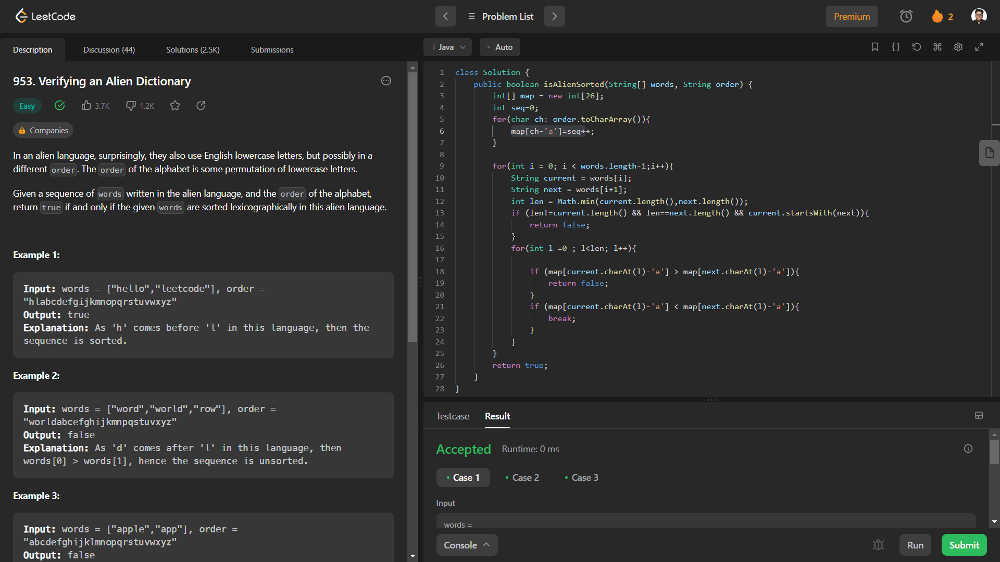

# Problem: Verifying an Alien Dictionary

Platform: Leetcode

Difficulty: Easy

Problem Link: https://leetcode.com/problems/verifying-an-alien-dictionary/

## Problem Statement:

In an alien language, surprisingly, they also use English lowercase letters, but possibly in a different order. The order of the alphabet is some permutation of lowercase letters.

Given a sequence of words written in the alien language, and the order of the alphabet, return true if and only if the given words are sorted lexicographically in this alien language.

Example 1:

    Input: words = ["hello","leetcode"], order = "hlabcdefgijkmnopqrstuvwxyz"

    Output: true

    Explanation: As 'h' comes before 'l' in this language, then the sequence is sorted.

Example 2:

    Input: words = ["word","world","row"], order = "worldabcefghijkmnpqstuvxyz"

    Output: false

    Explanation: As 'd' comes after 'l' in this language, then words[0] > words[1], hence the sequence is unsorted.

## My Approach:

    1. Map the order od letters from  to 1 to 26
    2. Then compare two words in a list letter by letter 
        - current=words[i]
        - next=words[i+1]
        - If current[0]==next[0] then continue with next letter
        - If they are different comapre with the letters mapped value
        - and return accordinglt
    3. Continue this for all the words in the string
    4. Also need to check for the condition
        - If the current word starts withe the next word then return false
        - Example:
            Input: words = ["apple","app"], order = "abcdefghijklmnopqrstuvwxyz"
            Output: false
            Explanation: The first three characters "app" match, and the second string is shorter (in size.) 
            According to lexicographical rules "apple" > "app",because 'l' > '∅', where '∅' is defined as the blank character 
            which is less than any other character

## Solution (In Java):

    class Solution {
    public boolean isAlienSorted(String[] words, String order) {
        int[] map = new int[26];
        int seq=0;
        for(char ch: order.toCharArray()){
            map[ch-'a']=seq++;
        }

        for(int i = 0; i < words.length-1;i++){
            String current = words[i];
            String next = words[i+1];
            int len = Math.min(current.length(),next.length());
            if (len!=current.length() && len==next.length() && current.startsWith(next)){
                return false;
            }
            for(int l =0 ; l<len; l++){
                
                if (map[current.charAt(l)-'a'] > map[next.charAt(l)-'a']){
                    return false;
                }
                if (map[current.charAt(l)-'a'] < map[next.charAt(l)-'a']){
                    break;
                }
            }
        }
        return true;
       }
    }

## Output:

